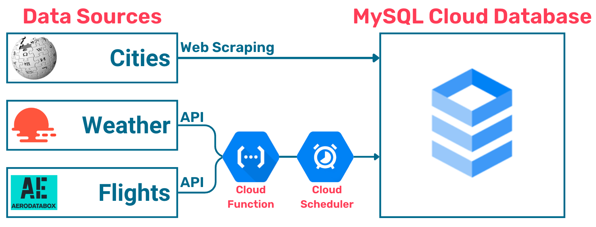
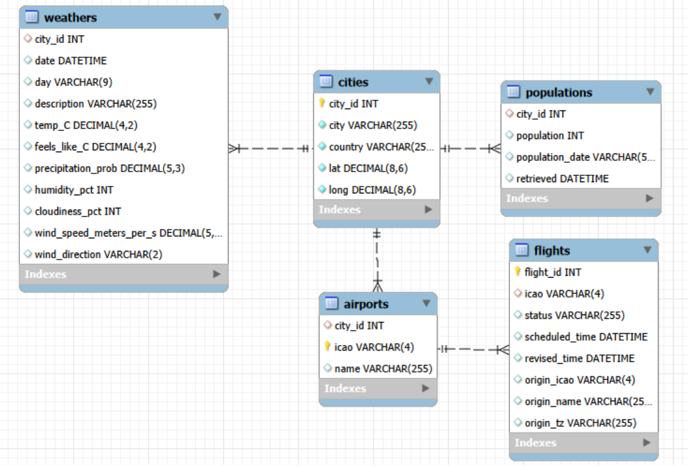

# Automated ETL Pipeline — Cloud-Based Data Engineering Project  
**Python | MySQL | Google Cloud Platform (Cloud Functions & Cloud Scheduler)**

---

## Project Overview

This project is a cloud-based ETL pipeline developed to simulate a real-world data engineering scenario.

The objective was to design and automate a data pipeline for a fictional e-scooter startup operating in large urban environments. The goal was to collect, transform, and store external data sources that could support downstream demand prediction and operational decision-making.

Rather than focusing on predictive modelling itself, this project emphasizes something foundational:

Reliable, automated data infrastructure.

The final result is a modular, serverless ETL pipeline deployed on Google Cloud Platform, integrating web scraping, APIs, relational database design, and scheduled automation.

---

## Business Context

E-scooter operations depend heavily on supply-demand balance. Scooters must be available where users expect them.

Urban dynamics introduce asymmetries:

- Commuters flow toward city centers in the morning  
- Tourists cluster near airports and landmarks  
- Rain suppresses demand  
- Flight arrivals create localized spikes in activity  

Predictive modelling can help optimize redistribution — but modelling depends on consistently updated data.

This project builds the foundational data pipeline required before such modelling can take place.

---

## Architecture Overview

The pipeline integrates three external data sources:

- **Cities (Wikipedia scraping)**  
- **Weather (OpenWeather API)**  
- **Flights (AeroDataBox API)**  

All data is stored in a shared **Cloud SQL (MySQL)** database.

The architecture separates slow-changing dimensions from frequently updated data:

- Cities data is collected and populated locally.
- Weather and flight data are deployed as serverless cloud functions and run automatically on a schedule.


---

## Pipeline Components

### 1️⃣ Cities — Local Pipeline (Slow-Changing Dimensions)

The `cities/` folder contains:

- A Jupyter notebook for data exploration and scraping
- Functions for:
  - Extracting city-level data from Wikipedia (city name, country, latitude & longitude, population)
  - Cleaning and transforming data
  - Creating the Cloud SQL schema
  - Populating tables with:
    - Cities
    - Airports
    - Population data

These tables act as slow-changing dimensions in the relational database.

The local pipeline connects directly to Cloud SQL and initializes the database structure.

---

### 2️⃣ Weather — Cloud Function

The `weather/` folder contains:

- `main.py` — Cloud Function entry point
- `functions.py` — API request and transformation logic
- `requirements.txt` — Deployment dependencies

This function:

- Calls the OpenWeather API
- Parses and transforms nested JSON responses
- Inserts structured weather observations into the cloud database

It is deployed using **Google Cloud Functions** and triggered automatically via **Cloud Scheduler**.

---

### 3️⃣ Flights — Cloud Function

The `flights/` folder contains:

- `main.py`
- `functions.py`
- `requirements.txt`

This function:

- Retrieves flight arrival data from the AeroDataBox API
- Cleans and structures relevant fields
- Inserts flight records into the database

Like the weather pipeline, it runs automatically on a defined schedule.

---


---

## Design Decisions

### Modularization

Each pipeline component lives in its own folder and can be developed, tested, and deployed independently.

### Separation of Concerns

- Static or slow-changing data is handled locally.
- Frequently updated data is automated in the cloud.

### Relational Data Model

The MySQL schema defines:

- Primary keys
- Foreign keys
- Constraints
- Structured relationships between cities, populations, airports, weather, and flight data



This ensures long-term data integrity and consistency.

### Serverless Deployment

Cloud Functions remove the need to manage infrastructure while enabling scalable execution.

### Automated Scheduling

Cloud Scheduler ensures weather and flight data update consistently without manual intervention.

---

## Tools Used

**Python (BeautifulSoup, Requests, Pandas)**  
Web scraping, API handling, transformation, and cleaning.

**MySQL (Cloud SQL)**  
Relational schema design and structured storage.

**Google Cloud Platform**
- Cloud SQL  
- Cloud Functions  
- Cloud Scheduler  

**Jupyter Notebook**  
Used for local development and experimentation in the cities pipeline.

---

## Running the Project

### Local Setup (Cities Pipeline)

```bash
python -m venv .venv

# macOS / Linux
source .venv/bin/activate

# Windows
.venv\Scripts\activate

pip install -r requirements.txt
```

1. Configure environment variables for:

    - Database credentials

    - API keys (where required)

2. Run the notebook or scripts inside the cities/ directory.

3. Tables will be created and populated in Cloud SQL.


### Deploy Weather & Flights

1. Set required environment variables (API keys and DB credentials).

2. Deploy weather/ and flights/ as separate Cloud Functions.

3. Create Cloud Scheduler jobs to trigger execution at defined intervals.

4. Monitor logs via the GCP Console.


### What This Project Demonstrates

- Web scraping using BeautifulSoup

- API integration and JSON parsing

- Data cleaning and transformation

- Relational schema design

- Cloud SQL connectivity

- Serverless deployment

- Automated scheduling

- Designing data systems, not just scripts


### Key Takeaways

- Reliable data infrastructure is foundational to analytics and modelling.

- Modular code design improves maintainability and clarity.

- Automation changes how we interact with data — pipelines can run independently.

- Even simple ETL systems require careful thinking about structure and reliability.


### Related Article

A detailed narrative explanation of this project is available here:

👉 https://medium.com/@del.murphy/from-field-ecologist-to-cloud-data-engineer-in-two-weeks-78fd92999c8b